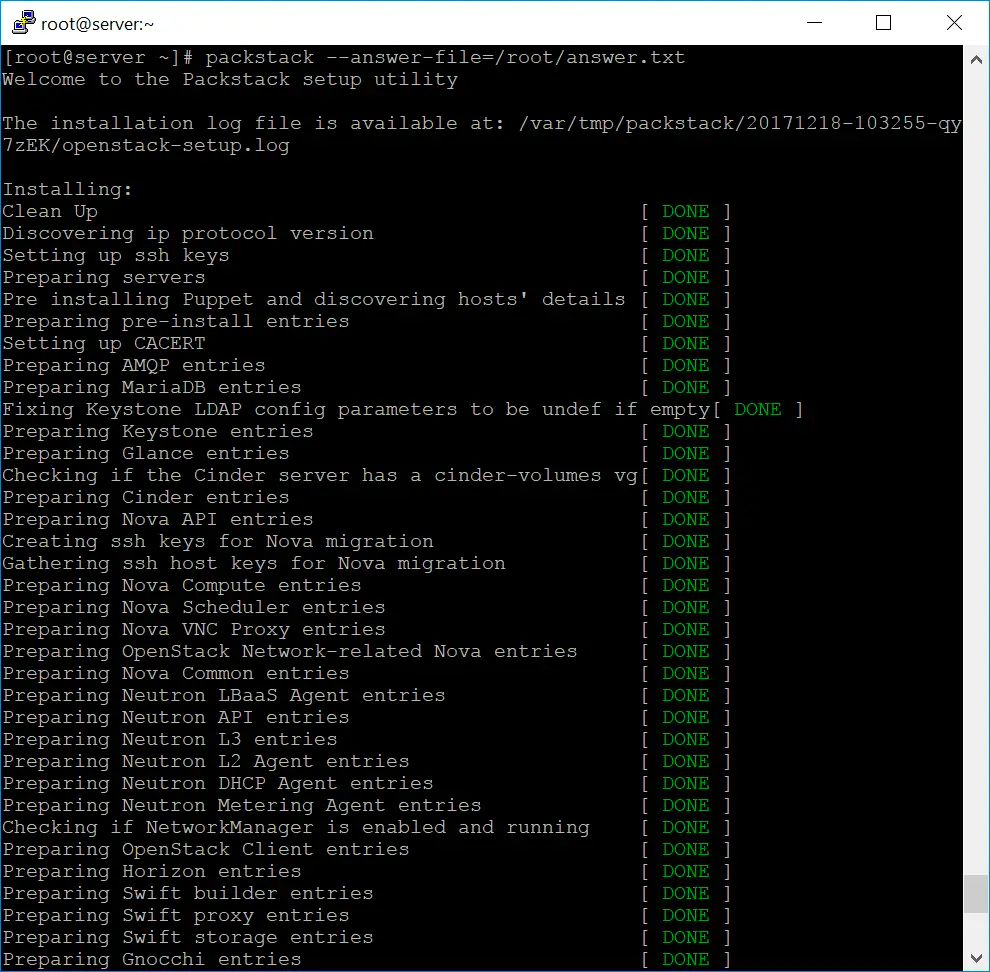
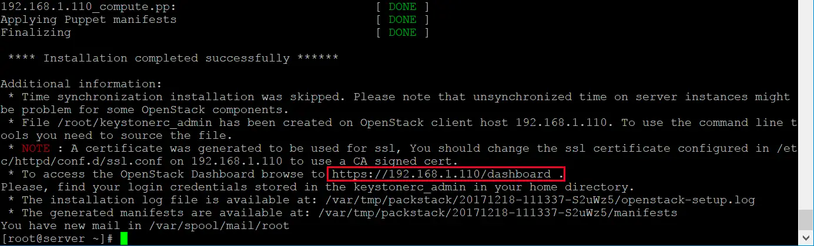
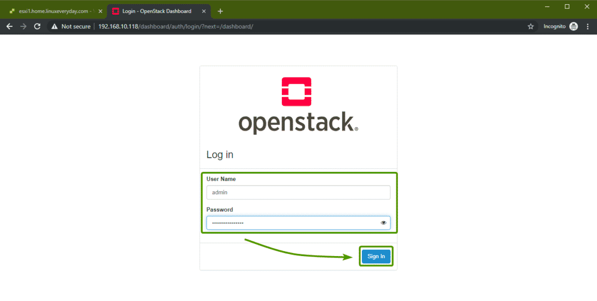

# Installation of Packstack on CentOS

**Objective:** In this lab, you will learn how to install OpenStack using Packstack on a CentOS system.

### Requirements:
- A fresh installation of CentOS 7
- Minimum 16GB of RAM
- At least 50GB of free disk space
- Internet access
- Before you do anything, make sure to set the LANG and LC_ALL environment variables correctly with the following command:
```
echo -e "LANG=en_US.utf-8\nLC_ALL=en_US.utf-8\n" > /etc/environment
```

### Step-by-step Instructions:

1. **Disable Selinux**
    
**It is important to disable selinux**

- Open the terminal.
- Run the following command to edit the configuration file.
  ```bash
  sudo vi /etc/selinux/config
  ```
- Change the value of `SELINUX` to `disabled`.
- Save and close the file.
- Reboot the system.
- Verify that selinux is disabled.

  ```bash
  sestatus
  ```
2. **Making sure VT-x is enabled**

Make sure your system has at least 16GB of RAM and a processor with VT support. Check the VT support using the below command.

 ```bash
 egrep --color 'vmx|svm' /proc/cpuinfo | wc -l
 ```

output should be a value greater than 0.

3. **Install the RDO repository**

To begin, you need to setup RDO repositories for installing OpenStack on your system.

 ```bash
 yum install -y https://rdoproject.org/repos/rdo-release.rpm
 ```

4. **Update the System:**

Run the following command to update all installed packages.

 ```bash
 sudo yum update -y
 ```
   
5. **Reboot**

6. **Disable NetworkManager and firewalld:**

Run the following commands to disable NetworkManager and firewalld.

```bash
systemctl disable firewalld
systemctl disable NetworkManager
systemctl stop firewalld
systemctl stop NetworkManager
systemctl enable network
systemctl start network
```


5. **Update the System Again:**

Run the following command to update the system.
```bash
sudo yum update -y
```

6. **Install Packstack Installer:**

Run the following command to install the Packstack Installer.
```bash
 yum install -y openstack-packstack
```

7. **Generate an Answer File:**
- Run the following command to generate an answer file.
```bash
packstack --gen-answer-file=answer.txt
```

8. **Edit the Answer File (Optional):**

You can modify `answer.txt` using a text editor like vi or nano to customize your installation.

```
vi answer.txt
```

Here, we will install the OpenStack without demo project. Also, we will create an OVS bridge called “br-ex” for external connectivity to instances (VM) through a logical segment called “extnet”.


Make sure the physical interface (ens192) you mention in this file matches the network adapter available on your system.

```
# Skip the provision of Demo project
CONFIG_PROVISION_DEMO=n
# Config OpenStack Dashboard over SSL
CONFIG_HORIZON_SSL=n
# Map physical network bridge to the logical name. <Logical Name:Bridge Name>
CONFIG_NEUTRON_OVS_BRIDGE_MAPPINGS=extnet:br-ex
# Create bridge for external connectivity. <Bridge Name: NW card name>
CONFIG_NEUTRON_OVS_BRIDGE_IFACES=br-ex:ens192
```

**extnet**: Logical name for our external physical connection.

**br-ex**: Bridge adapter

**eth0 or ens192**: Network Interface name

9. **Install**
- Run the following command to begin the installation.
 ```bash
 packstack --answer-file=/root/answer.txt
 ```
     


On completion, you should get a message something like this.




9. **Access the OpenStack Dashboard:**
- Once the installation is completed, you will be provided with a URL to access the OpenStack dashboard.
- Now, to find the OpenStack Horizon dashboard password, run the following command:

```
cat keystonerc_admin | grep PASSWORD
```

You should see a screen like this:




#### Verification:
- Open a web browser and navigate to the URL provided at the end of the installation.
- Log in with the credentials provided.

#### Conclusion:
You have successfully installed OpenStack using Packstack on CentOS. You can now explore and manage your OpenStack environment through the web interface or the command-line interface.
