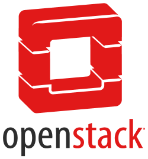

# Openstack Labs

Labs instructions for Openstack training sessions.

## Introduction

This repository contains the labs for the Openstack training sessions. The labs are divided into two sections:

- CLI Based Labs
- GUI Based Labs
- Setup Labs

## Labs Structure

Each lab is a markdown file that contains the following sections:

- Duration: The estimated time to complete the lab.
- Objective: The objective of the lab.
- Pre-requisites: The pre-requisites for the lab.
- Step-by-Step Guide: The step-by-step guide to complete the lab.
- Summary: The summary of the lab.

## Pre-requisites:

- Access to the OpenStack CLI
- Openstack installed on Ubuntu 22.04

- wget
    - Note: If you don't have wget installed, you can install it with  `apt install wget -y`

## Labs

### Setup Labs

- [Lab 1: Installing Openstack using Packstack](labs/packstack-install.md)

### CLI Based Labs

- [Lab 1: Creating an Image in OpenStack Using CLI](labs/image/cli.md)
- [Lab 2: Creating a Flavor Using the OpenStack CLI](labs/flavor/create_cli.md)
- [Lab 3: Managing Flavor Access Control](labs/flavor/access.md)
- [Lab 4: Access CLI in Ubuntu](labs/source_ubuntu.md)
- [Lab 5: List Flavors](labs/flavor/list_flavors.md)
- [Lab 6: List Images](labs/image/list_images.md)
-
- [Lab 11: Create an Instance Using the OpenStack CLI](labs/instance/instance_cli.md)

### GUI Based Labs

- [Lab 1: Creating an Image in OpenStack Using UI](labs/image/ui.md)
- [Lab 2: Creating a Flavor in OpenStack using UI](labs/flavor/create_ui.md)
- [Lab 3: Deleting a Flavor in OpenStack using UI](labs/flavor/delete_ui.md)

